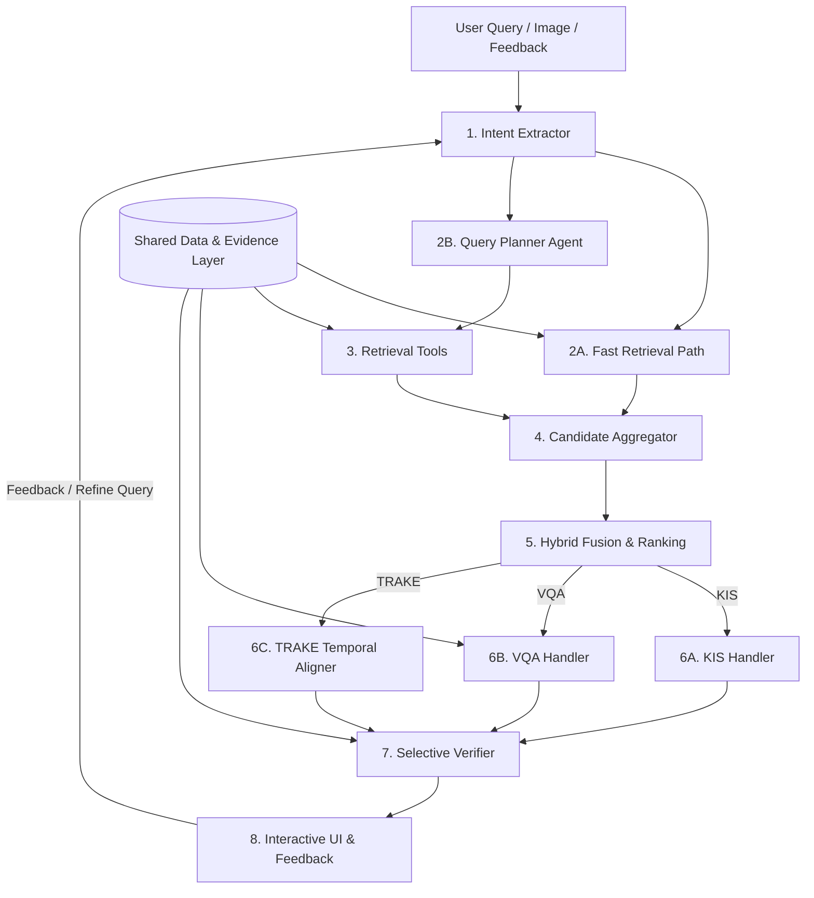

# Proposal Online Pipeline tổng hợp cho AIC 2026

## 1. Mục tiêu thiết kế

Online Pipeline nhận truy vấn của người dùng, truy xuất bằng chứng từ dữ liệu đã được preprocessing, tổng hợp kết quả từ nhiều nguồn và xử lý theo ba bài toán:

- **KIS**: tìm chính xác khoảnh khắc/video phù hợp nhất.
- **VQA**: tìm evidence liên quan rồi trả lời câu hỏi dựa trên evidence.
- **TRAKE**: tìm đúng video và căn chỉnh chuỗi sự kiện theo thời gian.

Thiết kế kết hợp:

- Fast Path, canonical evidence, provenance và selective verification từ Proposal 1.
- Intent Extractor, Agent planning, `CandidateRegion`, reranking và Human-in-the-loop từ Proposal 2.

Nguyên tắc:

1. Agent dùng để **phân tích và lập kế hoạch**, không thay thế code deterministic.
2. Retrieval Tool chỉ chịu trách nhiệm truy vấn dữ liệu.
3. Mọi kết quả phải được resolve về canonical ID và timestamp.
4. Frame/Shot/Clip/OCR/ASR từ nhiều nguồn được gom về `CandidateRegion`.
5. KIS, VQA và TRAKE dùng chung retrieval stack nhưng có bước xử lý cuối khác nhau.
6. VLM chỉ chạy trên tập candidate nhỏ.
7. Người dùng có thể xem, sửa và phản hồi kết quả.

---

# 2. Kiến trúc tổng thể



---

# 3. Shared Data & Evidence Layer

Đây là tầng dữ liệu dùng chung, không phải Agent và không tự thực hiện retrieval.

## Input

Output từ Offline Pipeline:

- Video metadata.
- Shot.
- Frame / Keyframe.
- Clip.
- OCR.
- ASR.
- Caption.
- Object Detection.
- Tracking.
- Embedding metadata.
- Model/run metadata.

## Output

Cung cấp các read-model/API chuẩn cho Online Pipeline:

- canonical entity reference;
- `EvidenceBundle`;
- temporal neighbors;
- media reference;
- provenance.

Ví dụ canonical reference:

```json
{
  "video_id": "L21_V003",
  "shot_id": "L21_V003_S014",
  "clip_id": "L21_V003_C038",
  "frame_id": "L21_V003_F0125",
  "start_ms": 30400,
  "end_ms": 36500
}
```

Ví dụ `EvidenceBundle`:

```json
{
  "video_id": "L21_V003",
  "start_ms": 30000,
  "end_ms": 40000,

  "frames": [],
  "ocr": [],
  "asr": [],
  "captions": [],
  "objects": [],
  "tracks": [],

  "provenance": []
}
```

## Vai trò

Giải quyết việc dữ liệu Offline nằm ở nhiều bảng/index khác nhau.

Các module Online không cần tự JOIN nhiều bảng hoặc tự suy đoán quan hệ Frame → Shot → Clip.

## Công việc cần triển khai

- Chuẩn hóa ID giữa PostgreSQL, FAISS, Elasticsearch.
- Chuẩn hóa timestamp về millisecond.
- Tạo API:
  - `get_evidence_bundle(entity_id)`
  - `get_temporal_neighbors(entity_id)`
  - `get_media_refs(entity_id)`
- Gắn provenance:
  - model;
  - version;
  - run_id;
  - confidence.
- Đảm bảo mọi ID trả lên Online đều resolve được.

---

# 4. Module 1 — Intent Extractor

## Input

`RawQuery`

Bao gồm:

```json
{
  "text": "...",
  "image_ref": null,
  "video_ref": null,
  "feedback": null,
  "session_id": "S01"
}
```

Input tối thiểu chỉ cần `text`.

## Output

`StructuredQuery`

```json
{
  "query_id": "Q001",
  "task": "TRAKE",

  "visual_queries": [],

  "ocr_constraints": [],
  "asr_constraints": [],
  "object_constraints": [],

  "events": [
    {
      "event_id": "E1",
      "description": "A man walks onto a stage"
    },
    {
      "event_id": "E2",
      "description": "The man receives a medal"
    },
    {
      "event_id": "E3",
      "description": "The man cries"
    }
  ],

  "temporal_constraints": [
    {
      "before": "E1",
      "after": "E2"
    },
    {
      "before": "E2",
      "after": "E3"
    }
  ],

  "negative_constraints": []
}
```

## Vai trò

Chuyển truy vấn tự nhiên thành cấu trúc thống nhất để toàn bộ pipeline phía sau hiểu cùng một ý nghĩa.

Module trả lời:

> Người dùng đang muốn tìm gì?

## Công việc cần thực hiện

### Task Classification

Xác định:

- KIS;
- VQA;
- TRAKE.

### Constraint Extraction

Tách các thông tin:

- visual;
- OCR;
- ASR;
- object;
- negative constraint.

Ví dụ:

> "Người đàn ông áo đỏ đứng cạnh bảng có chữ HCMC."

Có thể tách thành:

```json
{
  "visual_queries": ["man wearing red shirt"],
  "ocr_constraints": ["HCMC"],
  "object_constraints": ["person"]
}
```

### Event Decomposition

Với query nhiều sự kiện:

> "Người đàn ông bước lên sân khấu, nhận huy chương rồi khóc."

phải tách thành `E1`, `E2`, `E3`.

### Temporal Constraint Extraction

Xác định:

- before;
- after;
- then;
- optional gap constraint.

### Feedback Parsing

Nếu input đến từ vòng feedback:

> "Đúng người nhưng sai địa điểm."

thì cần bổ sung/chỉnh constraint tương ứng.

## Không thực hiện

Intent Extractor không:

- query database;
- chọn FAISS hay Elasticsearch;
- quyết định `top_k`;
- rank candidate;
- gọi VLM để kiểm tra kết quả.

## Yêu cầu triển khai

- JSON Schema/Pydantic cho `StructuredQuery`.
- Prompt cho KIS/VQA/TRAKE.
- Validate output.
- Retry/fallback nếu LLM trả sai schema.
- Không được tự tạo entity ID của corpus.

---

# 5. Module 2A — Fast Retrieval Path

## Input

`StructuredQuery`

Chỉ sử dụng những trường có thể chuyển trực tiếp thành retrieval query:

- `visual_queries`;
- `ocr_constraints`;
- `asr_constraints`;
- query text chính.

## Output

`SearchHit[]`

```json
{
  "source": "clip_embedding",
  "event_id": null,

  "entity_type": "clip",
  "entity_id": "L21_V003_C038",

  "video_id": "L21_V003",
  "start_ms": 30400,
  "end_ms": 36500,

  "rank": 3,
  "raw_score": 0.78
}
```

## Vai trò

Tạo kết quả ban đầu nhanh mà **không chờ Agent reasoning**.

Fast Path phù hợp với query đơn giản và đồng thời giúp UI có dữ liệu sớm trong khi Slow Path vẫn đang chạy.

## Công việc cần thực hiện

Chạy song song các retrieval đơn giản có thể xác định trực tiếp:

- Frame embedding.
- Shot embedding.
- Clip embedding.
- OCR.
- ASR.
- Caption.

Không bắt buộc gọi tất cả. Chỉ gọi modality có query tương ứng.

Ví dụ query chỉ chứa visual description thì không cần chờ OCR/ASR.

## Lưu ý

Fast Retrieval **không tự merge CandidateRegion và không thực hiện final ranking**.

Nó chỉ trả `SearchHit[]` cho Candidate Aggregator.

---

# 6. Module 2B — Query Planner Agent

## Input

- `StructuredQuery`.
- Optional Fast Retrieval result.
- Optional previous retrieval result.
- Optional user feedback.
- Danh sách Retrieval Tools hệ thống hiện hỗ trợ.

## Output

`ToolCall[]`

```json
[
  {
    "tool_call_id": "T01",
    "event_id": "E1",
    "tool": "clip_search",

    "parameters": {
      "query": "man walking onto a stage",
      "top_k": 200
    }
  },
  {
    "tool_call_id": "T02",
    "event_id": "E2",
    "tool": "clip_search",

    "parameters": {
      "query": "man receiving a medal",
      "top_k": 200
    }
  }
]
```

## Vai trò

Quyết định:

> Với StructuredQuery hiện tại, cần tìm bằng những Retrieval Tool nào?

Agent chịu trách nhiệm reasoning và planning, không trực tiếp xử lý database.

## Công việc cần thực hiện

Agent có thể:

- chọn Frame / Shot / Clip retrieval;
- chọn OCR/ASR/Caption retrieval;
- chọn Object/Tracking retrieval;
- tạo subquery;
- tạo nhiều cách diễn đạt query;
- đặt `top_k`;
- giữ `event_id` khi query TRAKE;
- quyết định lấy thêm neighbors;
- replan sau feedback hoặc kết quả retrieval kém.

Ví dụ:

> "Người đàn ông áo đỏ đứng cạnh bảng có chữ HCMC."

Agent có thể tạo:

1. `clip_search("man wearing red shirt")`
2. `ocr_search("HCMC")`

## Giới hạn

Agent không được:

- execute SQL tùy ý;
- viết Python tùy ý rồi chạy;
- đọc trực tiếp FAISS;
- sửa database;
- tự tạo corpus ID;
- tự khẳng định một candidate đúng nếu chưa có retrieval evidence.

## Yêu cầu triển khai

- Tool allow-list.
- Schema cho `ToolCall`.
- Giới hạn số tool call.
- Timeout/budget.
- Mọi TRAKE tool call phải giữ `event_id`.

---

# 7. Module 3 — Retrieval Tools

Đây là tập các hàm deterministic được Fast Path hoặc Query Planner Agent sử dụng.

Mọi Retrieval Tool **phải trả cùng contract `SearchHit[]`**.

---

## 7.1. Visual Retrieval Tools

### Tool

- `frame_search()`
- `shot_search()`
- `clip_search()`
- `image_similarity_search()`

### Input

Ví dụ:

```json
{
  "query": "person receiving a medal",
  "top_k": 200,
  "event_id": "E2"
}
```

Hoặc với image search:

```json
{
  "image_ref": "F128",
  "top_k": 100
}
```

### Output

`SearchHit[]`

### Việc cần implement

- Encode text/image query bằng đúng embedding model.
- Query FAISS index tương ứng.
- Resolve FAISS ID → canonical entity ID.
- Lấy:
  - `video_id`;
  - `start_ms`;
  - `end_ms`.
- Giữ raw similarity và rank.

---

## 7.2. Text Retrieval Tools

### Tool

- `ocr_search()`
- `asr_search()`
- `caption_search()`

### Input

```json
{
  "query": "Ho Chi Minh City",
  "mode": "similarity",
  "top_k": 100,
  "event_id": null
}
```

### Output

`SearchHit[]`

### Việc cần implement

- Elasticsearch query.
- Exact / fuzzy / lexical mode khi cần.
- Resolve document → canonical video/timestamp.
- Trả rank và raw score.

---

## 7.3. Object / Tracking Retrieval Tools

### Tool

- `object_search()`
- `track_search()`

### Input

Ví dụ:

```json
{
  "object_class": "person",
  "constraints": {
    "min_count": 2
  },
  "top_k": 100
}
```

Hoặc:

```json
{
  "object_class": "person",
  "relation": "continuous_track",
  "top_k": 100
}
```

### Output

`SearchHit[]`

### Vai trò

Dùng khi query có evidence mà visual/text embedding khó biểu diễn tốt:

- số lượng object;
- sự hiện diện của object;
- object liên tục trong một shot;
- chuyển động/track.

Tracking là evidence bổ sung, không bắt buộc dùng trong mọi query.

---

## 7.4. Evidence Utility Tools

### Tool

- `get_evidence_bundle()`
- `get_temporal_neighbors()`
- `get_media_refs()`

### Input

Canonical entity/candidate reference.

Ví dụ:

```json
{
  "video_id": "L21_V003",
  "start_ms": 30000,
  "end_ms": 40000
}
```

### Output

Tùy tool:

- `EvidenceBundle`;
- neighbor entity IDs;
- media paths/URLs.

### Vai trò

Lấy thêm context cho candidate đã biết.

Các tool này **không phải corpus-wide retrieval**.

---

# 8. Module 4 — Candidate Aggregator

## Input

Toàn bộ `SearchHit[]` từ:

- Fast Retrieval;
- Retrieval Tools do Agent gọi.

Ví dụ:

```text
Frame hit     : 32.0s
Clip hit      : 30–36s
Shot hit      : 29–39s
OCR hit       : 31.8s
```

## Output

`CandidateRegion[]`

```json
{
  "candidate_id": "CR001",

  "event_id": "E1",

  "video_id": "L21_V003",
  "start_ms": 29000,
  "end_ms": 39000,

  "evidence": [
    {
      "source": "frame_embedding",
      "entity_id": "F123",
      "rank": 5,
      "raw_score": 0.71
    },
    {
      "source": "clip_embedding",
      "entity_id": "C38",
      "rank": 2,
      "raw_score": 0.81
    },
    {
      "source": "ocr",
      "entity_id": "OCR291",
      "rank": 1,
      "raw_score": 8.4
    }
  ]
}
```

## Vai trò

Giải quyết việc các Retriever trả về nhiều granularity khác nhau nhưng thực chất đang nói về cùng một vùng thời gian.

`CandidateRegion` là đơn vị chung dùng từ đây trở đi.

## Công việc cần thực hiện

### Resolve

Đảm bảo tất cả hit đã có:

- `video_id`;
- `start_ms`;
- `end_ms`.

### Group theo video

Khác `video_id` không được merge.

### Temporal grouping

Các evidence:

- overlap nhau;
- hoặc đủ gần nhau trong cùng Shot/Clip;

được gom thành một CandidateRegion.

### Deduplicate

Nhiều keyframe rất gần nhau không được biến thành nhiều candidate độc lập.

### Preserve evidence

Không được bỏ:

- source;
- rank;
- score;
- entity ID.

### Preserve TRAKE event

Candidate của `E1` và `E2` không được merge với nhau chỉ vì gần timestamp.

## Không thực hiện

Aggregator không:

- chấm final score;
- kiểm tra thứ tự TRAKE;
- gọi VLM;
- thực hiện hard-veto.

---

# 9. Module 5 — Hybrid Fusion & Ranking

## Input

- `CandidateRegion[]`
- `StructuredQuery`

## Output

`RankedCandidateRegion[]`

```json
{
  "candidate_id": "CR001",
  "event_id": "E1",

  "video_id": "L21_V003",
  "start_ms": 29000,
  "end_ms": 39000,

  "fusion_score": 0.87,

  "constraint_result": {
    "hard_constraints_passed": true,
    "negative_constraints_passed": true
  },

  "evidence": []
}
```

## Vai trò

Chấm điểm CandidateRegion dựa trên toàn bộ evidence.

Đây là nơi duy nhất thực hiện **hybrid ranking chung giữa các retrieval source**.

## Baseline Scoring

Do FAISS similarity, BM25 và các score khác không cùng thang đo, baseline dùng Weighted RRF:

\[
Score(c)=\sum_m\frac{w_m}{k+rank_m(c)}
\]

Sau khi có validation set có thể bổ sung calibrated score.

## Constraint Processing

### Hard Constraint

Điều kiện bắt buộc.

Ví dụ:

> "Cầm kem bên bờ biển."

Candidate chỉ có biển nhưng không có evidence về kem có thể bị loại hoặc đánh dấu không đủ hard constraint.

### Negative Constraint

Ví dụ:

> "Không ở trong nhà."

Candidate có indoor evidence rõ ràng bị loại/giảm mạnh.

### Soft Evidence

Ví dụ caption hoặc object phụ chỉ tăng score.

## TRAKE

Fusion vẫn xử lý riêng từng event:

- E1 candidates;
- E2 candidates;
- E3 candidates.

Không ghép sequence tại module này.

## Yêu cầu triển khai

- Weighted RRF baseline.
- Weight cấu hình được.
- Hard/negative constraint evaluator.
- Score breakdown để debug.
- Deterministic ranking.
- Không mất `event_id`.

---

# 10. Module 6A — KIS Handler

## Input

- `StructuredQuery`
- `RankedCandidateRegion[]`

## Output

`KISResult[]`

```json
{
  "video_id": "L21_V003",

  "start_ms": 31800,
  "end_ms": 35200,

  "representative_frame_id": "F128",

  "score": 0.91,

  "evidence_ids": [
    "F128",
    "OCR291",
    "C38"
  ]
}
```

## Vai trò

Candidate Fusion đã tìm được **region tốt nhất**.

KIS Handler chịu trách nhiệm xác định:

> Trong region đó, khoảnh khắc/frame nào nên được người dùng xem hoặc submit?

## Công việc cần thực hiện

### Top-N Selection

Chỉ xử lý một số RankedCandidate đầu.

### Neighbor Expansion

Lấy:

- frame trước/sau;
- frame trong Shot;
- nearby clip;

để tránh trường hợp retrieval đúng vùng nhưng frame đại diện chưa chính xác.

### Precise Moment Selection

Chọn:

- timestamp;
- representative frame;

phù hợp nhất trong region.

Có thể dùng lại frame-level embedding hoặc rule theo evidence timestamp.

### Prepare KIS Result

Trả đầy đủ:

- video;
- timestamp;
- frame;
- evidence;
- score.

## Không thực hiện

Không hybrid fusion lần thứ hai.

Không search lại toàn corpus.

---

# 11. Module 6B — VQA Handler

## Input

- Question trong `StructuredQuery`.
- `RankedCandidateRegion[]`.
- `EvidenceBundle` lấy từ Shared Data & Evidence Layer.

## Output

`VQAResult`

```json
{
  "answer": "Người đàn ông nhận được huy chương vàng.",

  "confidence": 0.87,

  "evidence_ids": [
    "F128",
    "ASR312",
    "C38"
  ],

  "status": "answered"
}
```

## Vai trò

VQA gồm hai phần rõ ràng:

1. retrieval tìm vùng chứa câu trả lời;
2. VLM trả lời dựa trên evidence của vùng đó.

VLM không search database.

## Công việc cần thực hiện

### Candidate Selection

Chọn Top-K CandidateRegion liên quan nhất đến câu hỏi.

### Evidence Assembly

Với từng region, gọi `get_evidence_bundle()` để lấy:

- frame;
- OCR;
- ASR;
- caption;
- object;
- tracking khi cần.

### Evidence Filtering

Không đưa toàn bộ evidence vào VLM.

Chỉ giữ evidence:

- đúng khoảng thời gian;
- liên quan câu hỏi;
- nằm trong context limit.

### VLM Answering

Input:

- question;
- frames;
- timed text evidence.

Output bắt buộc:

- `answer`;
- `confidence`;
- `evidence_ids`;
- `status`.

### Answer Normalization

Chuẩn hóa nếu câu hỏi yêu cầu:

- số;
- yes/no;
- tên riêng;
- đơn vị;
- format submission.

### Insufficient Evidence

Nếu evidence không đủ:

```json
{
  "status": "uncertain"
}
```

Không ép VLM đoán.

---

# 12. Module 6C — TRAKE Temporal Aligner

## Input

`RankedCandidateRegion[]` được chia theo `event_id`.

Ví dụ:

```json
{
  "E1": ["CR001", "CR002"],
  "E2": ["CR101", "CR102"],
  "E3": ["CR201", "CR202"]
}
```

Cùng với:

- `temporal_constraints`;
- optional gap constraints.

## Output

`TemporalSequence[]`

```json
{
  "video_id": "L21_V003",

  "events": [
    {
      "event_id": "E1",
      "candidate_id": "CR001",
      "start_ms": 12000,
      "end_ms": 16000
    },
    {
      "event_id": "E2",
      "candidate_id": "CR101",
      "start_ms": 34000,
      "end_ms": 38000
    },
    {
      "event_id": "E3",
      "candidate_id": "CR202",
      "start_ms": 51000,
      "end_ms": 55000
    }
  ],

  "sequence_score": 0.91
}
```

## Vai trò

TRAKE không chọn từng event độc lập.

Module phải tìm:

- cùng một video;
- chứa các event;
- đúng thứ tự;
- đúng policy về khoảng cách/thời gian.

## Công việc cần thực hiện

### Same-video Grouping

Group candidate của E1/E2/... theo `video_id`.

Video không có đủ candidate cần thiết có thể:

- bị loại;
- hoặc giữ với penalty nếu thiết kế cho phép missing event.

### Temporal Alignment

Tìm sequence thỏa:

\[
t(E_1)<t(E_2)<...<t(E_n)
\]

Baseline nên dùng:

- Dynamic Programming;
- hoặc Beam Search.

Không Cartesian product toàn bộ candidate nếu `top_k` lớn.

### Gap Constraint

Ví dụ:

- E2 xảy ra sau E1 tối đa 60 giây;
- event không được overlap.

### Sequence Scoring

Khác Candidate Fusion.

Candidate Fusion đánh giá một event candidate.

TRAKE đánh giá cả chain:

\[
Score_{seq}
=
\sum_i Score(E_i)
-
GapPenalty
+
TemporalConsistency
\]

### First Occurrence

Nếu bài thi yêu cầu lần xuất hiện đầu tiên thì policy này xử lý tại đây.

## Không thực hiện

TRAKE Aligner không search FAISS/Elasticsearch.

Nếu event recall không đủ, nó trả trạng thái thiếu candidate để Planner Agent quyết định retrieval bổ sung.

---

# 13. Module 7 — Selective Verifier

## Input

Một trong:

- `KISResult`;
- `VQAResult`;
- `TemporalSequence`.

Cùng với:

- `StructuredQuery`;
- `EvidenceBundle`.

## Output

`VerifiedResult`

```json
{
  "status": "accepted",

  "confidence": 0.94,

  "supporting_evidence_ids": [
    "F128",
    "C38"
  ],

  "failed_constraints": []
}
```

Các status:

- `accepted`
- `rejected`
- `uncertain`

## Vai trò

Kiểm tra sâu **chỉ những kết quả thực sự cần VLM**.

Verifier không phải một reranker chạy trên toàn bộ candidates.

## Khi nào gọi

### KIS

- Top-1 và Top-2 sát nhau.
- Hành động khó xác nhận.
- Hard constraint chưa chắc chắn.

### VQA

- answer confidence thấp;
- OCR/ASR/visual mâu thuẫn.

### TRAKE

- một event trong chain có confidence thấp;
- nhiều chain gần bằng điểm.

## Công việc cần thực hiện

- Rule `need_verification()`.
- Load EvidenceBundle.
- Prompt VLM kiểm chứng.
- Bắt VLM chỉ trích dẫn evidence ID có sẵn.
- Parse:
  - accepted;
  - rejected;
  - uncertain.
- Giới hạn số VLM call.

## Khi rejected

Không tự search lại database.

Hệ thống có thể:

- thử candidate kế tiếp;
- hoặc gửi tín hiệu cần replan.

---

# 14. Module 8 — Interactive UI & Feedback

Vai trò của hiển thị và phản hồi người dùng cũng được nhấn mạnh trong tài liệu tập huấn hệ thống tìm kiếm video.

## Input

- Fast Retrieval results.
- KIS/VQA/TRAKE final results.
- Verification status.
- Evidence summary.
- Media references.

## Output

Một trong các action chuẩn.

### Final Selection

```json
{
  "action": "select",
  "candidate_id": "CR001"
}
```

### Reject

```json
{
  "action": "reject",
  "candidate_id": "CR001",
  "reason": "wrong_location"
}
```

### Refine

```json
{
  "action": "refine",
  "constraint": "shirt must be red"
}
```

### Find Similar

```json
{
  "action": "find_similar",
  "frame_id": "F128"
}
```

## Công việc cần triển khai

### Result Gallery

Hiển thị:

- thumbnail;
- video ID;
- timestamp;
- score;
- evidence source.

### Player

- Seek trực tiếp tới candidate.
- Xem trước/sau vùng candidate.

### Neighbor Exploration

- previous/next frame;
- previous/next shot;
- nearby clips.

### Evidence Panel

Cho người dùng biết candidate được tìm thấy từ:

- Visual;
- OCR;
- ASR;
- Caption;
- Object.

### Feedback Controls

Tối thiểu:

- Relevant.
- Not Relevant.
- Wrong Video.
- Wrong Event.
- Wrong Location.
- Bad OCR.
- Find Similar.

---

# 15. Feedback Loop

Feedback không tạo một pipeline mới mà quay lại pipeline hiện tại.

## Input

User feedback từ Module 8.

```json
{
  "candidate_id": "CR001",
  "action": "reject",
  "reason": "wrong_location"
}
```

## Output

Một trong hai:

1. `StructuredQuery` được cập nhật.
2. Planner Agent tạo ToolCall mới.

## Cách xử lý

Ví dụ query ban đầu:

> "Người đàn ông ăn kem."

Feedback:

> "Đúng người nhưng phải ở bờ biển."

Intent Extractor bổ sung location constraint.

Planner Agent sau đó chỉ tạo retrieval bổ sung cần thiết thay vì chạy lại mọi modality.

Feedback chỉ cần tồn tại trong session ở phiên bản đầu.

Không cần Reflection Memory dài hạn.

---

# 16. Các Data Contract chính

Chỉ giữ các contract cần để nối module.

| Contract | Producer | Consumer | Mục đích |
|---|---|---|---|
| `RawQuery` | UI | Intent Extractor | Input người dùng |
| `StructuredQuery` | Intent Extractor | Fast Path / Planner / Fusion / Handler | Ý nghĩa query chuẩn hóa |
| `ToolCall` | Planner Agent | Retrieval Tools | Yêu cầu retrieval |
| `SearchHit` | Fast Path / Retrieval Tools | Candidate Aggregator | Retrieval result chuẩn |
| `CandidateRegion` | Candidate Aggregator | Hybrid Fusion | Gom evidence cùng vùng |
| `RankedCandidateRegion` | Hybrid Fusion | KIS/VQA/TRAKE | Candidate đã rank |
| `EvidenceBundle` | Shared Evidence Layer | VQA / Verifier | Evidence đa modality |
| `KISResult` | KIS Handler | Verifier/UI | Kết quả KIS |
| `VQAResult` | VQA Handler | Verifier/UI | Kết quả VQA |
| `TemporalSequence` | TRAKE | Verifier/UI | Chuỗi event TRAKE |
| `VerifiedResult` | Verifier | UI | Kết quả kiểm chứng |

---

# 17. Phân chia trách nhiệm

| Thành phần | Nhiệm vụ chính | Search corpus | Reasoning | Ranking |
|---|---|---:|---:|---:|
| Intent Extractor | Hiểu query | Không | Có | Không |
| Fast Retrieval | Search nhanh | Có | Không | Chỉ source rank |
| Query Planner Agent | Lập kế hoạch retrieval | Không | Có | Không |
| Retrieval Tools | Thực thi search | Có | Không | Chỉ source rank |
| Candidate Aggregator | Merge cùng region | Không | Không | Không |
| Hybrid Fusion | Fusion đa nguồn | Không | Không | Có |
| KIS Handler | Chọn moment chính xác | Không toàn corpus | Không | Fine selection |
| VQA Handler | Answer từ evidence | Không | VLM | Không hybrid |
| TRAKE Aligner | Ghép temporal chain | Không | Không | Sequence score |
| Selective Verifier | Kiểm chứng case khó | Không | VLM | Không fusion |
| UI | Hiển thị & feedback | Không | Người dùng | Không |

Ranh giới quan trọng:

> **Agent quyết định cần tìm gì và gọi tool nào. Retrieval Tool thực hiện tìm kiếm. Aggregator gom kết quả. Fusion chấm candidate. Task Handler xử lý yêu cầu riêng của KIS/VQA/TRAKE.**

---

# 18. Thứ tự triển khai

## Phase 1 — Contract & Retrieval Core

- Shared contracts.
- Retrieval Tools.
- Candidate Aggregator.
- Hybrid Fusion.

Mục tiêu: đưa nhiều nguồn retrieval về được một `RankedCandidateRegion[]`.

## Phase 2 — KIS

- Intent Extractor baseline.
- Fast Retrieval.
- KIS Handler.
- UI gallery/player.

Mục tiêu: KIS chạy end-to-end.

## Phase 3 — Query Planner Agent

- Tool calling.
- Multi-query planning.
- Feedback replan.
- Budget/timeout.

## Phase 4 — VQA

- EvidenceBundle API.
- Evidence packing.
- VLM answering.
- Answer normalization.

## Phase 5 — TRAKE

- Event decomposition.
- Event candidate retrieval.
- Temporal alignment.
- Sequence scoring.

## Phase 6 — Verification & Optimization

- Selective Verifier.
- Async retrieval.
- Cache.
- Timeout.
- Latency optimization.
- Benchmark và tuning weight.

---

# 19. Kết luận

Proposal giữ nguyên kiến trúc đã thống nhất:

**Intent Extractor → Fast Path / Query Planner → Retrieval Tools → Candidate Aggregator → Hybrid Fusion → KIS/VQA/TRAKE → Selective Verifier → UI & Feedback.**

Các module được phân chia để không chồng trách nhiệm:

- Intent Extractor **hiểu query**.
- Planner **lập kế hoạch**.
- Retrieval Tool **search dữ liệu**.
- Aggregator **gom cùng vùng thời gian**.
- Fusion **xếp hạng đa nguồn**.
- KIS/VQA/TRAKE **giải logic riêng của từng task**.
- Verifier **chỉ kiểm tra các case khó**.
- UI **cho người dùng quan sát và feedback**.

Mỗi module hiện có Input, Output, trách nhiệm và phần việc cần triển khai cụ thể, đủ để giao cho một thành viên phát triển độc lập mà không cần tự diễn giải lại kiến trúc.